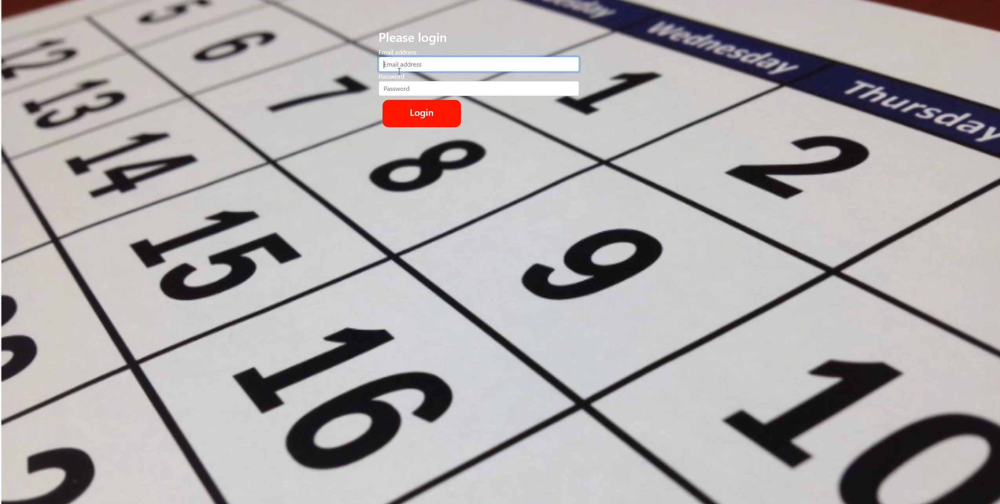

<!-- _**IMPORTANT: Please read the Acknowledgements section before using using the web app**_ -->

# SWE-Project

A group project for a Software Engineering class at Algoma University

## Goal

Create a simple calendar web application where users can view and manage their events.

### Subgoals

- Use a fullstack design: Frontend web page with backend database and REST API.
- Host the project in the cloud.

## Members

- Spencer Keene
- Nick Korsunski
- Connor Della-savia

## Tools

- HTML, CSS, JS (web page)
- Java with Spring (API)
- MySQL (Database)
- DigitalOcean (Cloud computing)

## Acknowledgements

With limited time to complete the project and little previous experience in creating large software projects, we decided to not focus on many security aspects. The main goal when completing this project was to learn how to create a full-stack project (create a front and back end that are linked) and how to host it in the cloud so it is accessible 24/7 without the use of local machines.

Because of this, we recommend that you do not input any personal information when using our web app. You may use a fake email and password, as well as a fake name if you wish.

## Images

### Login

### Calendar view

### Day view

### Upcoming events

### Create events

